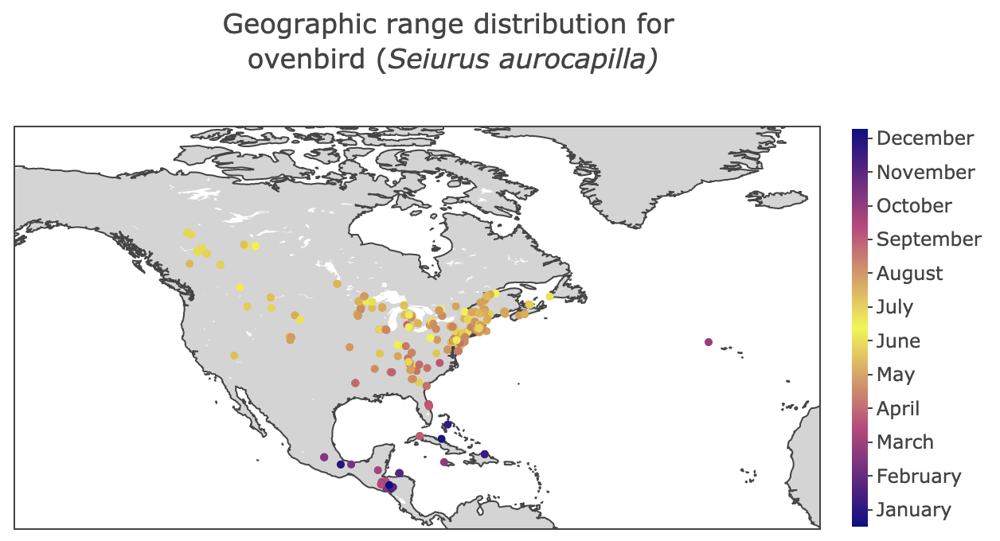

# BIRDMap

A [web app](https://bird-map.herokuapp.com) to visualize the migratory patterns of various bird species. When a user searches for a particular species, the web app displays its geographic range map, which provides insight into its migratory and behavioral patterns. Below is a generated geographic range map for the ovenbird (_Seiurus aurocapilla_), showing the species' inhabitance of higher latitudes in the summer months (yellow/orange hues) and subsequent migration to more tropical areas in the winter months (blue/purple hues).

     

## Details

BIRDMap is hosted through Heroku and built on the Python Flask framework. Its backend uses a SQL database to query latitude, longitude, and temporal information. Geographic range maps are dynamically generated with the [plotly](https://github.com/plotly/plotly.js) API using data compiled from [Xeno-Canto](https://www.xeno-canto.org/), a crowdsourced citizen science project where users around the world can upload reports of bird sightings.
